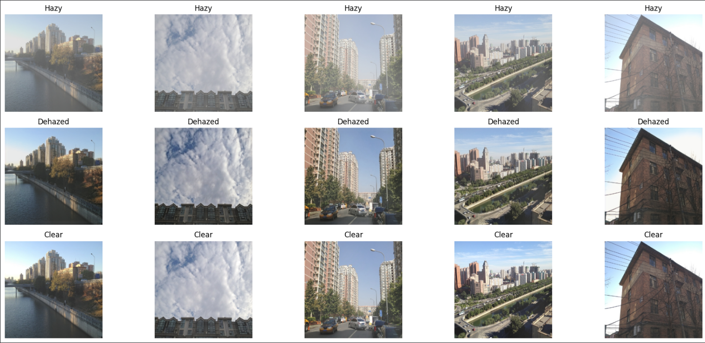

# Draco-DehazeNet
Attention-based deep learning model for single image dehazing

## Results

## Quantitative Results

| Image | PSNR (dB) | SSIM | MSE | MAE |
|------|----------|------|------|------|
| 1 | 24.25 | 0.9672 | 0.0038 | 0.0569 |
| 2 | 20.98 | 0.9512 | 0.0080 | 0.0862 |
| 3 | 28.14 | 0.9783 | 0.0015 | 0.0327 |
| 4 | 27.46 | 0.9788 | 0.0018 | 0.0343 |
| 5 | 26.99 | 0.9648 | 0.0020 | 0.0389 |
